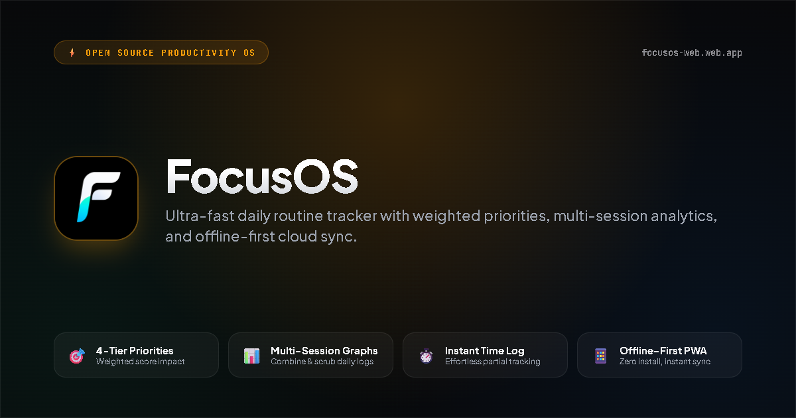

<p align="center">
  
</p>

<h1 align="center">FocusOS</h1>

<p align="center">
  <strong>The ultra-fast, distraction-free productivity OS and routine tracker built for ruthless daily consistency.</strong>
</p>

<p align="center">
  <a href="https://focusos-web.web.app"></a>
  <a href="https://focusos-web.web.app"></a>
  <a href="https://github.com/sreyasts/focusos/actions/workflows/deploy.yml"></a>
  <a href="LICENSE"></a>
  <a href="https://react.dev"></a>
</p>

<p align="center">
  <a href="#-why-focusos">Why FocusOS</a> •
  <a href="#-live-app--instant-access">Live Demo</a> •
  <a href="#-core-features">Key Features</a> •
  <a href="#-mobile-pwa-installation">PWA Install</a> •
  <a href="#-local-development">Getting Started</a> •
  <a href="#-architecture">Architecture</a> •
  <a href="#-contributing">Contributing</a>
</p>

---

## ⚡ Why FocusOS?

Most productivity apps trap you in **organizational procrastination**: endless nested sub-tasks, complex project boards, confusing menus, and intrusive paywalls that take more time to configure than actually doing the work.

**FocusOS is different.** It is designed around one core reality: **Execution beats organization.**

* **No Clutter, Zero Friction**: Open the app, see your current scheduled time-block, and start executing.
* **Weighted Priorities**: High-impact deep work (Physics, Code, Mathematics) contributes more to your score than low-friction tasks.
* **Non-Study Routine Exclusions (0XP)**: Track your full schedule (school, meals, gym, sleep) without penalizing your productivity score.
* **100% Offline-First**: Works instantly on airplanes, underground metros, and remote spots with zero internet connection.
* **Privacy First**: Your data stays on your device in dual-redundant IndexedDB & LocalStorage, with optional Google Cloud Sync whenever you choose.

---

## 🚀 Live App & Instant Access

You can use FocusOS right now in your browser with **zero account required**:

**[👉 Launch FocusOS (focusos-web.web.app)](https://focusos-web.web.app)**

> FocusOS is built as an offline-first Progressive Web App (PWA). You can use it directly in any modern desktop or mobile browser, or install it to your home screen for a seamless standalone app experience.

---

## 🎯 Core Features

### 1. 4-Tier Task Priorities & Weighted Scoring
Tasks aren't created equal. FocusOS weights each task based on cognitive intensity:
* 🔴 **High Priority (`4x`)**: Core deep-work subjects (e.g., Mathematics, Coding, Hard Science).
* 🔵 **Medium Priority (`3x`)**: Standard productive blocks (e.g., Revision, Problem Sets).
* 🟡 **Low Priority (`2x`)**: Supporting habits (e.g., Reading, Housework, Admin).
* ⚪ **Lowest Priority (`1x`)**: Minimal routine checks.

### 2. Skip Adding XP (`0XP`) Exclusions
Routines like *Going to School*, *Lunch*, *Travel*, or *Sleep* are critical to schedule, but shouldn't artificially inflate or dilute your study score. Toggle **Skip XP (0XP)** on any routine to track it seamlessly without affecting your daily XP calculation.

### 3. One-Tap Routine Duplication
Study in the morning and again in the evening? Duplicate any existing routine in 1-tap:
* Tap **Duplicate Routine** in the routine editor or task 3-dots menu (⋮).
* FocusOS clones the name, icon, priority, and `0XP` settings, automatically calculating an evening time slot.

### 4. Multi-Session Aggregate Graphs & Interactive Scrubber
* **Unified Daily Tracking**: If you have multiple sessions of the same subject on one day (e.g., Morning Study: 2.0h, Evening Study: 1.5h), FocusOS aggregates them into a **Total Daily Hours (3.5h)** metric.
* **Interactive Scrubber Tooltip**: Drag your finger across the SVG chart to inspect itemized breakdowns and target completion states.
* **Dedicated Task Graphs**: Switch instantly between `Overall Score`, `Study`, `Gym`, `Skills`, or add custom task curves via `+ Add Task Graph`.

### 5. Period Milestones & Consistency Streaks
* **Target Pace Guides**: Dashed benchmark guide (e.g., 80% score or 2.0h/day pace).
* **Tiered Period Milestones**:
  * 🥉 **Bronze Milestone** (25% Target Met)
  * 🥈 **Silver Milestone** (50% Target Met)
  * 🥇 **Gold Milestone** (75% Target Met)
  * 💎 **Diamond Milestone** (100% Target Met!)
* **Consistency Streaks**: Real-time counter of days meeting your daily threshold across 7D, 14D, 30D, and 90D timeframes.

### 6. Redesigned, Effortless Time Logging
Log partial task completion in seconds without mental math:
* **Hero Time Display**: Large typography with instant tap-to-type capability and automatic hour conversion.
* **Visual Target Progress Bar**: Color-coded progress bar that automatically turns emerald green on overtime (`125% · Overtime +15m`).
* **Tactile Steppers & Native Range Slider**: `-15`, `-5`, `+5`, `+15` buttons and 5-minute slider increments.
* **4 Smart Contextual Presets**: Automatically generated `25%`, `50%`, `75%`, and `Full` pills.

### 7. Smart Web-Audio Alarms & Schedule Handovers
* **Synthesized Web Audio Alarms**: Works offline without external MP3 dependencies.
* **Advance Notifications**: Configurable lead alerts (`0m Exact`, `1m`, `2m`, `5m` advance warning).
* **Handover Detection**: Dispatches unified transition alerts when one block ends and the next begins.

### 8. Universal Client Storage & Cloud Sync
* **Dual-Redundant Storage**: Saves every action simultaneously to IndexedDB and LocalStorage (`fo6_history` + `focusos_history_master_backup`).
* **Deep Recovery Scanner**: Automatically scans all browser databases and recovers historical logs if a browser cache is cleared.
* **Google Cloud Sync**: One-tap sign-in with Google to sync across phones, tablets, and laptops.

---

## 📱 Mobile PWA Installation

FocusOS is a fully certified Progressive Web App. You can install it directly to your home screen with zero app store downloads:

### On iPhone (iOS Safari):
1. Open **[focusos-web.web.app](https://focusos-web.web.app)** in Safari.
2. Tap the **Share** button (box with an arrow pointing up).
3. Scroll down and tap **Add to Home Screen**.
4. Tap **Add**. FocusOS now launches in full-screen standalone mode with no browser address bar!

### On Android (Chrome):
1. Open **[focusos-web.web.app](https://focusos-web.web.app)** in Chrome.
2. Tap the **three dots menu** (⋮) or tap the **"Install FocusOS"** banner.
3. Tap **Install**. FocusOS will be added to your app drawer and home screen.

---

## 💻 Local Development

### Prerequisites
* **Node.js** 18+ (Node 20 or 22 recommended)
* **npm** 9+

### Setup
```bash
# 1. Clone the repository
git clone https://github.com/sreyasts/focusos.git
cd focusos

# 2. Install dependencies
npm install --legacy-peer-deps

# 3. Start local Vite development server
npm run dev

# 4. Open in browser
# http://localhost:5173
```

### Production Build
```bash
# Build optimized static distribution
npm run build

# Preview production build locally
npm run preview
```

---

## 🏗️ Architecture & Tech Stack

```
focusos/
├── .github/workflows/       # GitHub Actions CI/CD (auto-deploy on push to master)
├── public/                  # PWA Manifest, Authentic FocusOS icons, SEO sitemap & robots.txt
│   ├── icon.png             # Authentic high-resolution 1254x1254 FocusOS icon
│   ├── og-image.png         # OpenGraph 1200x630 social share card
│   ├── manifest.json        # PWA configuration
│   ├── sitemap.xml          # Search engine index sitemap
│   └── robots.txt           # Search crawler permissions
├── src/
│   ├── services/
│   │   ├── alarmEngine.js        # Precision Web Audio synth engine for offline alarms
│   │   ├── notificationEngine.js # Lead-time notifications & in-app toast dispatcher
│   │   ├── storageRecovery.js    # Universal dual-storage engine & deep recovery crawler
│   │   └── firebaseAuth.js       # Firebase Auth & Firestore cloud sync
│   ├── App.jsx              # Main FocusOS application
│   ├── App.js               # Standalone self-contained single-file bundle distribution
│   └── index.jsx            # React root mount
└── vite.config.mjs          # Fast Vite bundler configuration
```

---

## 🤝 Contributing

Contributions make the open-source community an incredible place to learn, inspire, and create. Any contributions you make are **greatly appreciated**.

Please read our [Contributing Guidelines](CONTRIBUTING.md) and [Code of Conduct](CODE_OF_CONDUCT.md) before submitting pull requests.

1. Fork the Project
2. Create your Feature Branch (`git checkout -b feat/AmazingFeature`)
3. Commit your Changes (`git commit -m 'feat: Add some AmazingFeature'`)
4. Push to the Branch (`git push origin feat/AmazingFeature`)
5. Open a Pull Request

---

## 📄 License

Distributed under the **MIT License**. See [`LICENSE`](LICENSE) for more information.

<p align="center">
  <sub>Built with ❤️ by <a href="https://github.com/sreyasts">Sreyas T S</a> for focused students and deep-work practitioners worldwide.</sub>
</p>
