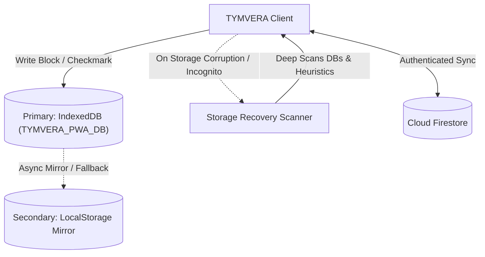

<p align="center">
  
</p>

<h1 align="center">TYMVERA</h1>

<p align="center">
  <strong>Offline-first, distraction-free productivity OS and weighted routine tracker built with React 19, Vite, and Cloud Firestore.</strong>
</p>

<p align="center">
  <a href="https://tymvera.web.app"></a>
  <a href="https://tymvera.web.app"></a>
  <a href="https://github.com/sreyasts/tymvera/actions"></a>
  <a href="LICENSE"></a>
  <a href="https://react.dev"></a>
</p>

---

## 1. System Overview

**TYMVERA** is a local-first Progressive Web App (PWA) designed for time-blocking execution, weighted priority routine tracking, and multi-session performance analytics. Unlike traditional project management tools that introduce administrative overhead, TYMVERA is built around minimal-latency time tracking with cognitive effort weighting.

- **Zero-Friction Execution**: Immediate timeline rendering of active blocks without login walls.
- **Weighted Scoring**: Evaluates productivity using prioritized weights (`Critical: 4x`, `High: 3x`, `Medium: 2x`, `Low: 1x`) with optional zero-XP exclusions for routine maintenance habits.
- **Dual-Redundant Storage**: Zero-data-loss architecture backing up IndexedDB transactions to LocalStorage mirrors.
- **Subcollection Cloud Architecture**: Scalable Firestore sync utilizing subcollections per day and setting to avoid monolithic document growth limits.

---

## 2. Architecture & Directory Structure

```
tymvera/
├── .github/
│   └── workflows/
│       ├── ci.yml                 # Automated test & production build verification
│       └── deploy.yml             # Firebase Hosting production deployment
├── public/
│   ├── manifest.json              # WebAPK-compliant PWA manifest
│   ├── sw.js                      # Offline service worker with cache-first routing
│   └── vendor/                    # Local fallbacks for Material Symbols & Tailwind CSS
├── src/
│   ├── components/                # Reusable UI components & modals
│   ├── services/
│   │   ├── alarmEngine.js         # Web Audio API synthesizer for offline alarms
│   │   ├── firebaseAuth.js        # Google Auth & subcollection Cloud Firestore sync
│   │   ├── notificationEngine.js  # Precision timeline notification dispatcher
│   │   └── storageRecovery.js     # Deep multi-schema browser storage recovery engine
│   ├── storage/
│   │   └── indexedDb.js           # Transaction-guarded IndexedDB layer & fallbacks
│   ├── App.jsx                    # Primary application orchestration component
│   └── index.jsx                  # React 19 root entrypoint
├── tests/
│   ├── storage.test.js            # IndexedDB operations, Promise error handling & fallback tests
│   ├── routine.test.js            # Weighted priority calculation & streak invariants
│   └── recovery.test.js           # Multi-schema recovery and backup serialization tests
├── firestore.rules                # Granular user ownership security rules
├── index.html                     # SPA root HTML template
├── package.json                   # Clean modern dependencies (Vite + React 19 + Vitest)
└── vite.config.mjs                # Production Vite configuration
```

---

## 3. Offline-First Storage Architecture

TYMVERA implements a local-first dual-storage pattern to ensure data integrity even in constrained, offline, or incognito browser environments:



1. **IndexedDB Layer (`src/storage/indexedDb.js`)**:
   - Manages asynchronous transactions on object store `app_data`.
   - Promise executors feature explicit `resolve` and `reject` handlers for both `request.onerror` and `tx.onabort` events.
2. **LocalStorage Fallback**:
   - Every write mirrors critical keys (`fo6_history`, `fo6_presets`, `fo6_alarms`) to synchronous `localStorage`.
   - If IndexedDB is blocked or quota-exceeded, reads and writes fall back gracefully without disrupting application flow.
3. **Storage Recovery Engine (`src/services/storageRecovery.js`)**:
   - Scans all browser storage databases (`TYMVERA_PWA_DB`, legacy databases, raw JSON keys, PlusTwo study planner schemas).
   - Performs non-destructive heuristic merges if local caches are partially cleared.

---

## 4. Cloud Firestore Data Architecture & Security

### 4.1 Subcollection Hierarchy

To ensure scalability and prevent hitting Firestore's 1MB single-document quota as user history expands over multiple years, data is stored in discrete subcollections:

```
users/{userId}
├── (document fields: themeMode, chartViewMode, lastSyncedAt, daysLoggedCount)
├── settings/
│   └── current
│       └── (fields: presets, alarms, notificationConfig, updatedAt)
└── days/
    ├── 2026-09-20
    │   └── (fields: date, dailyScore, blocks, blocksList, updatedAt)
    ├── 2026-09-21
    └── ...
```

### 4.2 Security Rules (`firestore.rules`)

Data ownership is enforced at the rule level. Authenticated users are strictly restricted to reading and writing paths matching their own authenticated UID:

```javascript
rules_version = '2';
service cloud.firestore {
  match /databases/{database}/documents {
    match /users/{userId} {
      allow read, write: if request.auth != null && request.auth.uid == userId;
    }
    match /users/{userId}/{document=**} {
      allow read, write: if request.auth != null && request.auth.uid == userId;
    }
    match /{document=**} {
      allow read, write: if false;
    }
  }
}
```

---

## 5. Development & Testing

### Prerequisites
- Node.js \(\ge 20.0.0\)
- npm \(\ge 10.0.0\)

### Installation & Local Server

```bash
# Install dependencies
npm install

# Start local development server with HMR
npm run dev

# Preview production build locally
npm run preview
```

### Automated Testing

Unit and integration tests are executed via [Vitest](https://vitest.dev):

```bash
# Run full test suite
npm test
```

Test coverage includes:
- **`tests/storage.test.js`**: IndexedDB initialization, write/read cycles, error rejection regression tests, and LocalStorage fallback.
- **`tests/routine.test.js`**: 4-tier weighted priority scoring, zero-XP exclusions, partial duration credits, and streak continuity.
- **`tests/recovery.test.js`**: Multi-schema migration, PlusTwo plan converter, and backup serialization.

### Production Build

```bash
# Build optimized static distribution to dist/
npm run build
```

---

## 6. Privacy & Security

- **Zero Third-Party Trackers**: No intrusive behavioral advertising scripts or external tracker pixels.
- **Zero Audio Network Requests**: All notification chimes and alarms are synthesized on-the-fly via the Web Audio API without fetching external MP3 assets.
- **Client-Side Encryption Ready**: Google credentials stay within Firebase Auth; local routine data never leaves the browser unless the student explicitly links an account.

---

## 7. License

TYMVERA is open source software released under the [MIT License](LICENSE).
